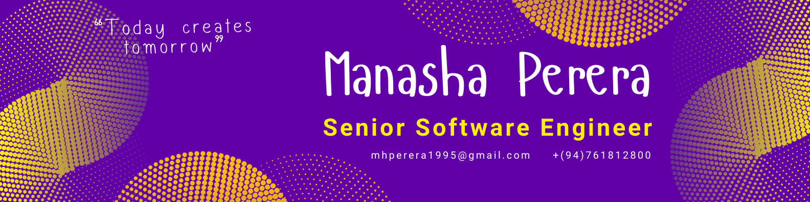

  
  
  
  
  
  
  
   

  <!--    -->

  
  ## Hi 👋 , I'm Manasha, Frontend Senior Software Engineer from Sri Lanka 🇱🇰.
  
  
 

  &nbsp;
   &nbsp;
  &nbsp;
  &nbsp;
   &nbsp;
   &nbsp;
   <!--   &nbsp; -->
   &nbsp;
   &nbsp;
   &nbsp;
   &nbsp;
   <!--   &  nbsp; -->
   &nbsp;
   <!--   &nbsp; -->
   <!--   &nbsp; -->
   <!--   &nbsp; -->
   &nbsp;
   &nbsp;
   
   &nbsp;
   <!--   &nbsp; -->
  

   

  

   I'm passionate about creating intuitive and visually stunning web applications. With over 5 years of experience in various domains including ERP solutions, smart factory solutions, and hospitality  management, I excel at turning complex requirements into seamless user experiences.
  

  
   

  

   
   
  

   

  

   Feel free to explore my repositories and reach out if you'd like to collaborate or chat about frontend development!
  

  
   
  
 

  

